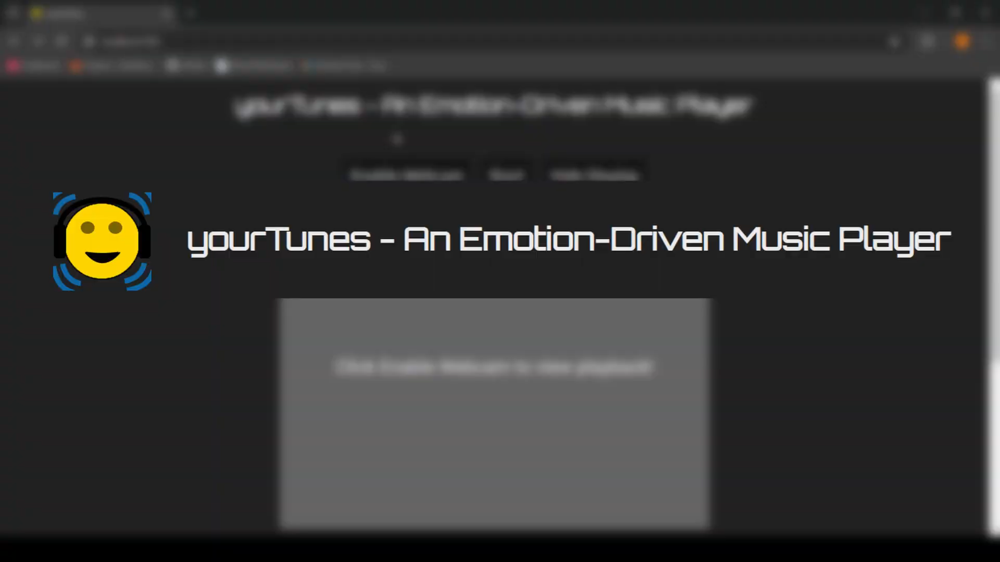

# yourTunes - An Emotion-Driven Music Player

## What is this?

Assigned as the project for the ICS2000 unit, yourTunes is a javascript based web application, hosted through flask able to indentify a user's emotion and play relevant music.

Feel free to learn more through the demo video below:

### How does it work?

yourTunes makes use of your webcam feed to find faces through the Viola-Jones method. This is done using OpenCV.js and the OpenCV default front facial haar-cascade. Once a face has been found it is cropped out of the video frame, converted to greyscale and resized to 224x224 pixels. This cropped face is then passed through a TensorFlow image classification model trained through Teachable machine which is capable of identifying different emotions on faces. This produces a set of 7 confidence scores, one for each emotion the model was trained on (Happy, Sad, Angry, Disgust, Fear, Surprise and Neutral). These confidence values are summed and the emotion with the highest value over a period of time is the chosen emotion. The site then prompts the user with a song depending on the selected emotion.

### How do I use it?
To use yourTunes the page must first be hosted, this can be done by simply running the flask-app.py script. Once this has been done
the page can be accessed by going to http://localhost:5000/  
Enjoy!

## Useful GAPT Proposal Information:
### Title
Emotion-driven music player: a hands-on computer vision,  
machine learning and human-computer interaction project
 
### Short Description of Task
The aim of this project involves the creation of a music 
player capable of selecting songs according to the user's present emotional state, as 
determined by their facial expressions. This endeavor offers students the chance to 
delve into computer vision, machine learning, and human-computer interaction, all 
while tackling a practical problem and its real-world application. Throughout the 
project, open-source tools and publicly available datasets will be used. 
 
### Deliverables
1) A web-based application,  
2) A report describing your approach and your findings,  
3) a short demo video
 
